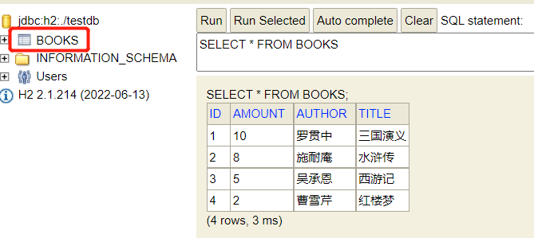

# library-demo

- 一个简易的图书管理系统，支持可以对数据库内图书进行增删改查

- 开发语言：Java 1.8

- 开发框架：Spring Boot 2.5.0

- 核心依赖：

1. Web启动类 ```spring-boot-starter-web```
2. JPA ```spring-boot-starter-data-jpa```
3. Security ```spring-boot-starter-security```
4. 缓存 ```spring-boot-starter-cache```
5. H2数据库 ```h2 2.1.214```
6. Lombok简化实体 ```lombok 1.18.24```
7. Swagger ```springdoc-openapi-ui 1.5.9```

## 项目架构

- 开发工具：Intellij IDEA


## RestFul接口列表

- Swagger UI （访问地址： [http://localhost:8080/swagger-ui.html）][http://localhost:8080/swagger-ui.html]


## 登录权限控制

- 实现方式：```Basic Auth```

- 如上图Swagger展示的接口列表，不带锁的API-即所有的```GET```请求是允许所有角色请求，
  带锁的API-即```POST/PUT/DELETE```请求是需要提供管理员用户名密码的，该系统管理员用户名为```admin```,
  密码为```12345678```

## 数据库

- H2数据库控制台url：[http://localhost:8080/h2-ui/][http://localhost:8080/h2-ui/]

- H2数据库链接配置：


- H2数据库默认存在表以及默认数据(位于```./testdb.mv.db```):



## 主要缓存

- 首次查询之后缓存已查
```@Cacheable(value="book", key="#id") // 缓存key为id的数据到缓存book```

- 更新数据之后缓存更新
```@CachePut(value="book", key="#book.id") // 缓存更新的数据到缓存，其中缓存名称为book数据的key是book的id```

- 删除数据之后删除缓存
```@CacheEvict(value="book") // 从缓存book中删除key为id的数据```

## 日志

- 除SpringBoot框架下自动打印的日志外，另外增加两个类型的日志

1. 缓存成功日志


2. 请求返回日志

   
## 统一异常管理/统一返回体控制
由于时间原因，目前异常和返回体统一返回```ResponseEntity```类型

[http://localhost:8080/swagger-ui.html]: http://localhost:8080/swagger-ui.html）