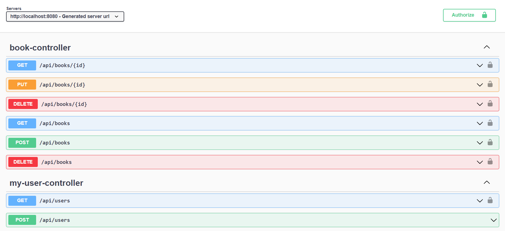

## 注意事项：在运行后请打开H2数据库控制台插入以下默认管理员数据和权限数据
- H2数据库控制台url：[http://localhost:8080/h2-ui/][http://localhost:8080/h2-ui/]
```SQL
INSERT INTO `roles` (`role_id`, `name`) VALUES ('1', 'ADMIN');
INSERT INTO `roles` (`role_id`, `name`) VALUES ('2' , 'USER');

-- 因为做了进行了加密，所以数据库不明文显示密码，此处管理员密码为admin
INSERT INTO `users` (`user_id`, `username`, `password`, `enabled`) VALUES ('1', 'admin', '$2a$10$IqTJTjn39IU5.7sSCDQxzu3xug6z/LPU6IF0azE/8CkHCwYEnwBX.', '1');

INSERT INTO `users_roles` (`user_id`, `role_id`) VALUES (1, 1); -- user admin has role ADMIN
INSERT INTO `users_roles` (`user_id`, `role_id`) VALUES (1, 2); -- user admin has role USER
```

# library-demo

- 一个简易的图书管理系统，支持可以对数据库内图书进行增删改查

- 开发语言：Java 1.8

- 开发框架：Spring Boot 2.5.0

- 核心依赖：

1. Web启动类 ```spring-boot-starter-web```
2. JPA ```spring-boot-starter-data-jpa```
3. Security ```spring-boot-starter-security```
4. 缓存 ```spring-boot-starter-cache```
5. H2数据库 ```h2 2.1.214```
6. Lombok简化实体 ```lombok 1.18.24```
7. Swagger ```springdoc-openapi-ui 1.5.9```

## 项目架构

- 开发工具：Intellij IDEA


## RestFul接口列表

- Swagger UI 
  -访问地址： [http://localhost:8080/swagger-ui.html][http://localhost:8080/swagger-ui.html] 



## 登录权限控制

- 实现方式：基于JDBC的用户存储对Spring Security做配置
  
- 授权方式：基于不同角色做Basic Http
  
- 角色
  
  1. ADMIN（管理员）：可以对图书进行增加、修改、删除，查找所有用户
  2. USER（普通用户）: 可以对图书进行查找
  3. 所有人：可以进行注册

- 对基于上图Swagger展示的接口列表和有关权限的说明

  
## 数据库

- H2数据库控制台url：[http://localhost:8080/h2-ui/][http://localhost:8080/h2-ui/]

- H2数据库链接配置：


- 表BOOKS示例:


- 表USERS示例：

  
- 表ROLES示例：

  
- 表USERS_ROLES示例：


## 主要缓存

- 首次查询之后缓存已查
```@Cacheable(value="book", key="#id") // 缓存key为id的数据到缓存book```

- 更新数据之后缓存更新
```@CachePut(value="book", key="#book.id") // 缓存更新的数据到缓存，其中缓存名称为book数据的key是book的id```

- 删除数据之后删除缓存
```@CacheEvict(value="book") // 从缓存book中删除key为id的数据```

## 日志

- 除SpringBoot框架下自动打印的日志外，另外增加两个类型的日志

1. 缓存成功日志


2. 请求返回日志

   
3. 异常日志

   
## 统一异常管理
- 返回自定义异常体

eg. 404
  

eg. 400
  


## 统一返回体控制
请求成功的返回体统一返回```ResponseEntity```类型

eg. get


eg. post 


[http://localhost:8080/swagger-ui.html]: http://localhost:8080/swagger-ui.html）

[http://localhost:8080/h2-ui/]: http://localhost:8080/h2-ui

[http://localhost:8080/h2-ui/]: http://localhost:8080/h2-ui/